# Load data

## Open HuggingFace models


```r
# setwd("/Users/seantrott/Dropbox/UCSD/Research/NLMs/vlm_affordances/src/main_study/")
directory_path <- "../../data/processed/models/hf_models/"
csv_files <- list.files(path = directory_path, pattern = "*.csv", full.names = TRUE)
csv_list <- csv_files %>%
  map(~ read_csv(.))
```

```
## Rows: 108 Columns: 10
## ── Column specification ────────────────────────────────────────────────────────
## Delimiter: ","
## chr (7): text, condition, img_name, prompt_type, response_type, model_name, ...
## dbl (3): group_id, response, num_params
## 
## ℹ Use `spec()` to retrieve the full column specification for this data.
## ℹ Specify the column types or set `show_col_types = FALSE` to quiet this message.
## Rows: 108 Columns: 10
## ── Column specification ────────────────────────────────────────────────────────
## Delimiter: ","
## chr (7): text, condition, img_name, prompt_type, response_type, model_name, ...
## dbl (3): group_id, response, num_params
## 
## ℹ Use `spec()` to retrieve the full column specification for this data.
## ℹ Specify the column types or set `show_col_types = FALSE` to quiet this message.
## Rows: 108 Columns: 10
## ── Column specification ────────────────────────────────────────────────────────
## Delimiter: ","
## chr (7): text, condition, img_name, prompt_type, response_type, model_name, ...
## dbl (3): group_id, response, num_params
## 
## ℹ Use `spec()` to retrieve the full column specification for this data.
## ℹ Specify the column types or set `show_col_types = FALSE` to quiet this message.
## Rows: 108 Columns: 10
## ── Column specification ────────────────────────────────────────────────────────
## Delimiter: ","
## chr (7): text, condition, img_name, prompt_type, response_type, model_name, ...
## dbl (3): group_id, response, num_params
## 
## ℹ Use `spec()` to retrieve the full column specification for this data.
## ℹ Specify the column types or set `show_col_types = FALSE` to quiet this message.
## Rows: 108 Columns: 10
## ── Column specification ────────────────────────────────────────────────────────
## Delimiter: ","
## chr (7): text, condition, img_name, prompt_type, response_type, model_name, ...
## dbl (3): group_id, response, num_params
## 
## ℹ Use `spec()` to retrieve the full column specification for this data.
## ℹ Specify the column types or set `show_col_types = FALSE` to quiet this message.
## Rows: 108 Columns: 10
## ── Column specification ────────────────────────────────────────────────────────
## Delimiter: ","
## chr (7): text, condition, img_name, prompt_type, response_type, model_name, ...
## dbl (3): group_id, response, num_params
## 
## ℹ Use `spec()` to retrieve the full column specification for this data.
## ℹ Specify the column types or set `show_col_types = FALSE` to quiet this message.
## Rows: 108 Columns: 10
## ── Column specification ────────────────────────────────────────────────────────
## Delimiter: ","
## chr (7): text, condition, img_name, prompt_type, response_type, model_name, ...
## dbl (3): group_id, response, num_params
## 
## ℹ Use `spec()` to retrieve the full column specification for this data.
## ℹ Specify the column types or set `show_col_types = FALSE` to quiet this message.
## Rows: 108 Columns: 10
## ── Column specification ────────────────────────────────────────────────────────
## Delimiter: ","
## chr (7): text, condition, img_name, prompt_type, response_type, model_name, ...
## dbl (3): group_id, response, num_params
## 
## ℹ Use `spec()` to retrieve the full column specification for this data.
## ℹ Specify the column types or set `show_col_types = FALSE` to quiet this message.
## Rows: 108 Columns: 10
## ── Column specification ────────────────────────────────────────────────────────
## Delimiter: ","
## chr (7): text, condition, img_name, prompt_type, response_type, model_name, ...
## dbl (3): group_id, response, num_params
## 
## ℹ Use `spec()` to retrieve the full column specification for this data.
## ℹ Specify the column types or set `show_col_types = FALSE` to quiet this message.
## Rows: 108 Columns: 10
## ── Column specification ────────────────────────────────────────────────────────
## Delimiter: ","
## chr (7): text, condition, img_name, prompt_type, response_type, model_name, ...
## dbl (3): group_id, response, num_params
## 
## ℹ Use `spec()` to retrieve the full column specification for this data.
## ℹ Specify the column types or set `show_col_types = FALSE` to quiet this message.
## Rows: 108 Columns: 10
## ── Column specification ────────────────────────────────────────────────────────
## Delimiter: ","
## chr (7): text, condition, img_name, prompt_type, response_type, model_name, ...
## dbl (3): group_id, response, num_params
## 
## ℹ Use `spec()` to retrieve the full column specification for this data.
## ℹ Specify the column types or set `show_col_types = FALSE` to quiet this message.
## Rows: 108 Columns: 10
## ── Column specification ────────────────────────────────────────────────────────
## Delimiter: ","
## chr (7): text, condition, img_name, prompt_type, response_type, model_name, ...
## dbl (3): group_id, response, num_params
## 
## ℹ Use `spec()` to retrieve the full column specification for this data.
## ℹ Specify the column types or set `show_col_types = FALSE` to quiet this message.
## Rows: 108 Columns: 10
## ── Column specification ────────────────────────────────────────────────────────
## Delimiter: ","
## chr (7): text, condition, img_name, prompt_type, response_type, model_name, ...
## dbl (3): group_id, response, num_params
## 
## ℹ Use `spec()` to retrieve the full column specification for this data.
## ℹ Specify the column types or set `show_col_types = FALSE` to quiet this message.
## Rows: 108 Columns: 10
## ── Column specification ────────────────────────────────────────────────────────
## Delimiter: ","
## chr (7): text, condition, img_name, prompt_type, response_type, model_name, ...
## dbl (3): group_id, response, num_params
## 
## ℹ Use `spec()` to retrieve the full column specification for this data.
## ℹ Specify the column types or set `show_col_types = FALSE` to quiet this message.
## Rows: 108 Columns: 10
## ── Column specification ────────────────────────────────────────────────────────
## Delimiter: ","
## chr (7): text, condition, img_name, prompt_type, response_type, model_name, ...
## dbl (3): group_id, response, num_params
## 
## ℹ Use `spec()` to retrieve the full column specification for this data.
## ℹ Specify the column types or set `show_col_types = FALSE` to quiet this message.
## Rows: 108 Columns: 10
## ── Column specification ────────────────────────────────────────────────────────
## Delimiter: ","
## chr (7): text, condition, img_name, prompt_type, response_type, model_name, ...
## dbl (3): group_id, response, num_params
## 
## ℹ Use `spec()` to retrieve the full column specification for this data.
## ℹ Specify the column types or set `show_col_types = FALSE` to quiet this message.
## Rows: 108 Columns: 10
## ── Column specification ────────────────────────────────────────────────────────
## Delimiter: ","
## chr (7): text, condition, img_name, prompt_type, response_type, model_name, ...
## dbl (3): group_id, response, num_params
## 
## ℹ Use `spec()` to retrieve the full column specification for this data.
## ℹ Specify the column types or set `show_col_types = FALSE` to quiet this message.
## Rows: 108 Columns: 10
## ── Column specification ────────────────────────────────────────────────────────
## Delimiter: ","
## chr (7): text, condition, img_name, prompt_type, response_type, model_name, ...
## dbl (3): group_id, response, num_params
## 
## ℹ Use `spec()` to retrieve the full column specification for this data.
## ℹ Specify the column types or set `show_col_types = FALSE` to quiet this message.
## Rows: 108 Columns: 10
## ── Column specification ────────────────────────────────────────────────────────
## Delimiter: ","
## chr (7): text, condition, img_name, prompt_type, response_type, model_name, ...
## dbl (3): group_id, response, num_params
## 
## ℹ Use `spec()` to retrieve the full column specification for this data.
## ℹ Specify the column types or set `show_col_types = FALSE` to quiet this message.
## Rows: 108 Columns: 10
## ── Column specification ────────────────────────────────────────────────────────
## Delimiter: ","
## chr (7): text, condition, img_name, prompt_type, response_type, model_name, ...
## dbl (3): group_id, response, num_params
## 
## ℹ Use `spec()` to retrieve the full column specification for this data.
## ℹ Specify the column types or set `show_col_types = FALSE` to quiet this message.
```

```r
df_hf_models <- bind_rows(csv_list)

df_hf_models = df_hf_models %>%
  mutate(condition = str_to_title(sub("_.*", "", condition))) 

table(df_hf_models$model_name)
```

```
## 
##             align-base            bridgetower         clip-big-giant 
##                    216                    216                    216 
##             clip-giant           clip-huge-14  clip-vit-base-patch32 
##                    216                    216                    216 
## clip-vit-large-patch14             flava-full              vilt-coco 
##                    216                    216                    216 
##              vilt-f30k 
##                    216
```

## Load closed-source models


```r
directory_path <- "../../data/processed/models/closed_models//"
csv_files <- list.files(path = directory_path, pattern = "*.csv", full.names = TRUE)
csv_list <- csv_files %>%
  map(~ read_csv(.) %>% mutate(response = as.double(response)))
```

```
## New names:
## Rows: 108 Columns: 10
## ── Column specification
## ──────────────────────────────────────────────────────── Delimiter: "," chr
## (7): text, condition, img_name, response_type, model_name, version, prom... dbl
## (3): ...1, response, group_id
## ℹ Use `spec()` to retrieve the full column specification for this data. ℹ
## Specify the column types or set `show_col_types = FALSE` to quiet this message.
## Rows: 108 Columns: 9
## ── Column specification
## ──────────────────────────────────────────────────────── Delimiter: "," chr
## (7): text, condition, img_name, response_type, model_name, version, prom... dbl
## (2): response, group_id
## ℹ Use `spec()` to retrieve the full column specification for this data. ℹ
## Specify the column types or set `show_col_types = FALSE` to quiet this message.
## New names:
## Rows: 108 Columns: 10
## ── Column specification
## ──────────────────────────────────────────────────────── Delimiter: "," chr
## (7): text, condition, img_name, response_type, model_name, version, prom... dbl
## (3): ...1, response, group_id
## ℹ Use `spec()` to retrieve the full column specification for this data. ℹ
## Specify the column types or set `show_col_types = FALSE` to quiet this message.
## Rows: 108 Columns: 9
## ── Column specification
## ──────────────────────────────────────────────────────── Delimiter: "," chr
## (7): text, condition, img_name, response_type, model_name, version, prom... dbl
## (2): response, group_id
## ℹ Use `spec()` to retrieve the full column specification for this data. ℹ
## Specify the column types or set `show_col_types = FALSE` to quiet this message.
## New names:
## Rows: 108 Columns: 10
## ── Column specification
## ──────────────────────────────────────────────────────── Delimiter: "," chr
## (7): text, condition, img_name, response_type, model_name, version, prom... dbl
## (3): ...1, response, group_id
## ℹ Use `spec()` to retrieve the full column specification for this data. ℹ
## Specify the column types or set `show_col_types = FALSE` to quiet this message.
## Rows: 108 Columns: 9
## ── Column specification
## ──────────────────────────────────────────────────────── Delimiter: "," chr
## (7): text, condition, img_name, response_type, model_name, version, prom... dbl
## (2): response, group_id
## ℹ Use `spec()` to retrieve the full column specification for this data. ℹ
## Specify the column types or set `show_col_types = FALSE` to quiet this message.
## New names:
## Rows: 108 Columns: 10
## ── Column specification
## ──────────────────────────────────────────────────────── Delimiter: "," chr
## (7): text, condition, img_name, response_type, model_name, version, prom... dbl
## (3): ...1, response, group_id
## ℹ Use `spec()` to retrieve the full column specification for this data. ℹ
## Specify the column types or set `show_col_types = FALSE` to quiet this message.
## Rows: 108 Columns: 9
## ── Column specification
## ──────────────────────────────────────────────────────── Delimiter: "," chr
## (7): text, condition, img_name, response_type, model_name, version, prom... dbl
## (2): response, group_id
## ℹ Use `spec()` to retrieve the full column specification for this data. ℹ
## Specify the column types or set `show_col_types = FALSE` to quiet this message.
## • `` -> `...1`
```

```r
df_closed_models <- bind_rows(csv_list)

df_closed_models = df_closed_models %>%
  mutate(condition = str_to_title(sub("_.*", "", condition)))

table(df_closed_models$model_name)
```

```
## 
##     gpt-4-turbo gpt-4-turbo_100          gpt-4o      gpt-4o_100 
##             216             216             216             216
```

## Merge


```r
df_merged = df_hf_models %>%
  bind_rows(df_closed_models) %>%
  group_by(model_name, version) %>%
  mutate(response_z = scale(response))

df_merged$response_z <- as.numeric(unlist(df_merged$response_z))


### Z-score response
df_hf_models = df_hf_models %>%
  group_by(model_name, version) %>%
  mutate(response_z = scale(response))
```


# Confirmatory Analyses


```r
### Average z-scored response
df_summary <- df_merged %>%
  group_by(condition, model_name, num_params) %>%
  summarize(avg_response = mean(response_z, na.rm = TRUE),
            se_response = sd(response_z, na.rm = TRUE) / sqrt(n()))
```

```
## `summarise()` has grouped output by 'condition', 'model_name'. You can override
## using the `.groups` argument.
```

```r
### Plot avg z-scored response by condition
ggplot(df_summary, aes(x = model_name,
                       y = avg_response, 
                       color = condition, group = condition)) +
  geom_point(size = 3, 
             position = position_dodge(width = 0.5)) +  
  geom_errorbar(aes(ymin = avg_response - se_response, 
                    ymax = avg_response + se_response), 
                width = 0.2,
                position = position_dodge(width = 0.5)) + 
  labs(# title = "",
       x = "",
       y = "Z-scored Response",
       color = "") +
  coord_flip() +
  geom_hline(yintercept = 0, linetype = "dotted") +
  theme_minimal() +
  scale_color_viridis_d() +
  theme(axis.title = element_text(size=rel(1.2)),
        axis.text = element_text(size = rel(1.2)),
        legend.text = element_text(size = rel(1.2)),
        # legend.title = element_text(size = rel(1.5)),
        strip.text.x = element_text(size = rel(1.2)),
        legend.position = "bottom")
```

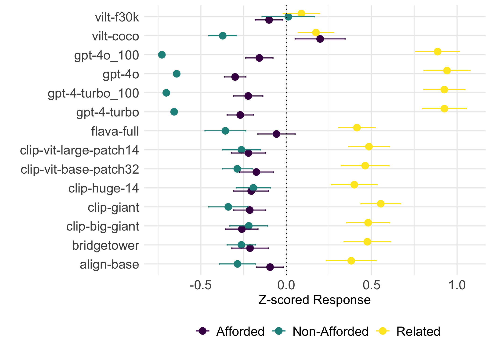<!-- -->

```r
ggplot(df_merged, aes(x = model_name, y = response_z, color = condition)) +
  # Plot raw data points with slight jitter for better visibility
  geom_jitter(size = 1, width = 0.2, height = 0, alpha = 0.1) +
  # Plot the means
  stat_summary(
    fun = mean,
    geom = "point",
    size = 3,
    position = position_dodge(width = 0.5)
  ) +
  # Plot the error bars (standard error)
  stat_summary(
    fun.data = mean_se,  # Calculate mean and standard error
    geom = "errorbar",
    width = 0.2,
    position = position_dodge(width = 0.5)
  ) +
  # Aesthetic adjustments
  labs(
    x = "",
    y = "Z-scored Response",
    color = ""
  ) +
  coord_flip() +
  geom_hline(yintercept = 0, linetype = "dotted") +
  theme_minimal() +
  scale_color_viridis_d() +
  theme(
    axis.title = element_text(size = rel(1.2)),
    axis.text = element_text(size = rel(1.2)),
    legend.text = element_text(size = rel(1.2)),
    strip.text.x = element_text(size = rel(1.2)),
    legend.position = "bottom"
  )
```

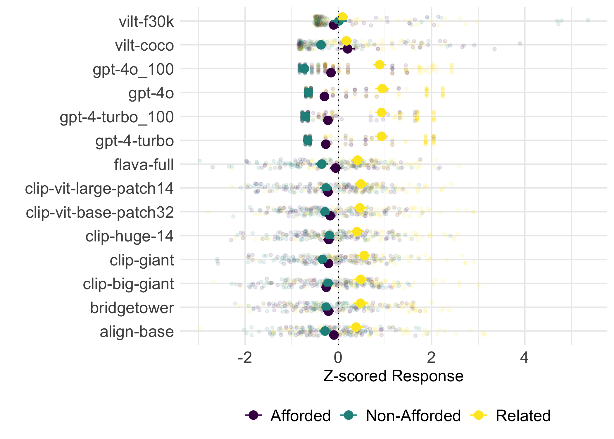<!-- -->


## Afforded (non-canonical) vs. Non-Afforded 


```r
# Define a function to fit the full and reduced lmer models and return the tidy summaries and LRT p-values
fit_and_tidy_lmer_model_with_lrt <- function(df) {
  # Fit the full mixed model
  full_model_fit <- lmer(response_z ~ condition + prompt_type + version + (1 | group_id), 
                         data = filter(df, condition != "Related"), 
                         REML = FALSE)
  
  # Fit the reduced mixed model (without condition)
  reduced_model_fit <- lmer(response_z ~ prompt_type + version + (1 | group_id), 
                            data = filter(df, condition != "Related"), 
                            REML = FALSE)
  
  # Perform the likelihood ratio test between the full and reduced models
  lrt_result <- anova(reduced_model_fit, full_model_fit)
  lrt_p_value <- lrt_result$`Pr(>Chisq)`[2]  # Extract the p-value for the comparison
  
  # Tidy the full model (extracting coefficients, p-values, etc.)
  model_tidy <- tidy(full_model_fit)
  
  # Return the model fit, tidy dataframe, and LRT p-value
  list(full_model_fit = full_model_fit, 
       reduced_model_fit = reduced_model_fit, 
       model_tidy = model_tidy, 
       lrt_p_value = lrt_p_value)
}

# Apply the function to each model_name group
model_results <- df_merged %>%
  group_by(model_name) %>%
  nest() %>%  # Nest data by model_name
  mutate(model_info = map(data, fit_and_tidy_lmer_model_with_lrt))  # Fit the models and get tidy output and LRT

# Extract the model fits, tidy dataframes, and LRT p-values for each model
model_fits <- model_results %>%
  mutate(full_model_fit = map(model_info, "full_model_fit"),
         reduced_model_fit = map(model_info, "reduced_model_fit"),
         model_tidy = map(model_info, "model_tidy"),
         lrt_p_value = map_dbl(model_info, "lrt_p_value"))  # Extract LRT p-values

# If you want to unnest the tidy summaries into one dataframe:
tidy_results <- model_fits %>%
  unnest(model_tidy)

# Filtering and plotting the results for the "conditionNon-Afforded" term
tidy_results %>%
  filter(term == "conditionNon-Afforded") %>%
  ggplot(aes(x = reorder(model_name, estimate),
             y = estimate)) +
  geom_point(size = 3, alpha = .6) +
  coord_flip() +
  geom_hline(yintercept = 0, linetype = "dotted") +
  geom_errorbar(aes(ymin = estimate - 2*std.error, 
                    ymax = estimate + 2*std.error), 
                alpha = .2,
                width=.2) + 
  labs(x = "Predictor",
       y = "Estimate",
       title = "Non-Afforded vs. Afforded") +
  theme_minimal()
```

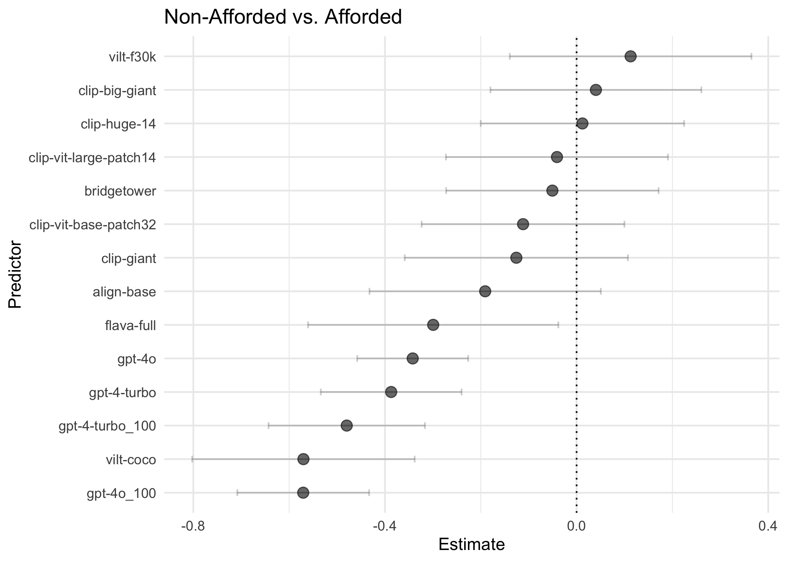<!-- -->

```r
# Extract just the results for "conditionNon-Afforded"
just_condition <- tidy_results %>%
  filter(term == "conditionNon-Afforded") 

# Create final dataframe

final_df <- data.frame(
  model = just_condition$model_name,
  original_p = just_condition$p.value,
  adjusted_p_holm = p.adjust(just_condition$p.value, method = "holm"),
  lrt_p_value = model_fits$lrt_p_value,
  adjusted_p_lrt_holm = p.adjust(model_fits$lrt_p_value, method = "holm")
) %>%
  mutate(lrt_sig = adjusted_p_lrt_holm < .05)

final_df %>%
  filter(lrt_sig == TRUE)
```

```
##             model   original_p adjusted_p_holm  lrt_p_value adjusted_p_lrt_holm
## 1       vilt-coco 2.763519e-06    2.763519e-05 2.642306e-06        2.642306e-05
## 2 gpt-4-turbo_100 3.479290e-08    4.175148e-07 3.273129e-08        3.927754e-07
## 3     gpt-4-turbo 5.719596e-07    6.291556e-06 5.436841e-07        5.980525e-06
## 4      gpt-4o_100 1.406419e-13    1.968987e-12 1.264180e-13        1.769853e-12
## 5          gpt-4o 3.011499e-08    3.914948e-07 2.831542e-08        3.681004e-07
##   lrt_sig
## 1    TRUE
## 2    TRUE
## 3    TRUE
## 4    TRUE
## 5    TRUE
```


## Related (canonical) vs. Non-Afforded 


```r
fit_and_tidy_lmer_model_with_lrt <- function(df) {
  # Fit the full mixed model
  full_model_fit <- lmer(response_z ~ condition + prompt_type + version + (1 | group_id), 
                         data = filter(df, condition != "Afforded"), 
                         REML = FALSE)
  
  # Fit the reduced mixed model (without condition)
  reduced_model_fit <- lmer(response_z ~ prompt_type + version + (1 | group_id), 
                            data = filter(df, condition != "Afforded"), 
                            REML = FALSE)
  
  # Perform the likelihood ratio test between the full and reduced models
  lrt_result <- anova(reduced_model_fit, full_model_fit)
  lrt_p_value <- lrt_result$`Pr(>Chisq)`[2]  # Extract the p-value for the comparison
  
  # Tidy the full model (extracting coefficients, p-values, etc.)
  model_tidy <- tidy(full_model_fit)
  
  # Return the model fit, tidy dataframe, and LRT p-value
  list(full_model_fit = full_model_fit, 
       reduced_model_fit = reduced_model_fit, 
       model_tidy = model_tidy, 
       lrt_p_value = lrt_p_value)
}

# Apply the function to each model_name group
model_results <- df_merged %>%
  group_by(model_name) %>%
  nest() %>%  # Nest data by model_name
  mutate(model_info = map(data, fit_and_tidy_lmer_model_with_lrt))  # Fit the models and get tidy output and LRT

# Extract the model fits, tidy dataframes, and LRT p-values for each model
model_fits <- model_results %>%
  mutate(full_model_fit = map(model_info, "full_model_fit"),
         reduced_model_fit = map(model_info, "reduced_model_fit"),
         model_tidy = map(model_info, "model_tidy"),
         lrt_p_value = map_dbl(model_info, "lrt_p_value"))  # Extract LRT p-values

# If you want to unnest the tidy summaries into one dataframe:
tidy_results <- model_fits %>%
  unnest(model_tidy)

# Filtering and plotting the results for the "conditionNon-Afforded" term
tidy_results %>%
  filter(term == "conditionRelated") %>%
  ggplot(aes(x = reorder(model_name, estimate),
             y = estimate)) +
  geom_point(size = 3, alpha = .6) +
  coord_flip() +
  geom_hline(yintercept = 0, linetype = "dotted") +
  geom_errorbar(aes(ymin = estimate - 2*std.error, 
                    ymax = estimate + 2*std.error), 
                alpha = .2,
                width=.2) + 
  labs(x = "Predictor",
       y = "Estimate",
       title = "Non-Afforded vs. Afforded") +
  theme_minimal()
```

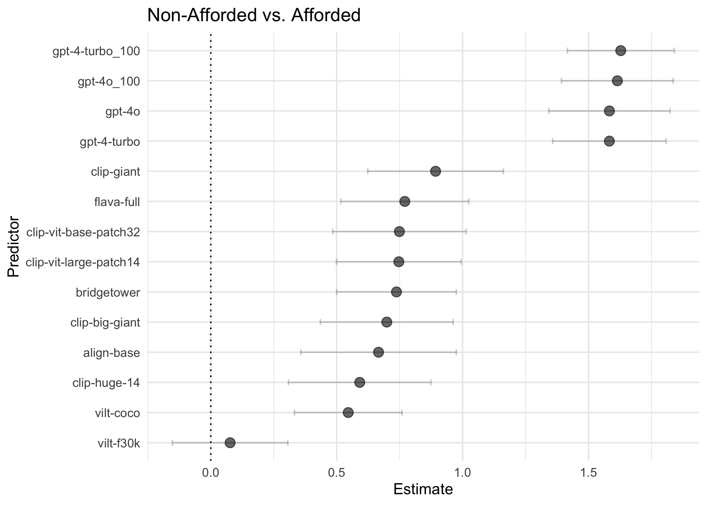<!-- -->

```r
# Extract just the results for "conditionNon-Afforded"
just_condition <- tidy_results %>%
  filter(term == "conditionRelated") 

# Create final dataframe

final_df <- data.frame(
  model = just_condition$model_name,
  original_p = just_condition$p.value,
  adjusted_p_holm = p.adjust(just_condition$p.value, method = "holm"),
  lrt_p_value = model_fits$lrt_p_value,
  adjusted_p_lrt_holm = p.adjust(model_fits$lrt_p_value, method = "holm")
) %>%
  mutate(lrt_sig = adjusted_p_lrt_holm < .05)

final_df %>%
  filter(lrt_sig == TRUE)
```

```
##                     model   original_p adjusted_p_holm  lrt_p_value
## 1              align-base 3.254730e-05    9.764191e-05 3.140569e-05
## 2             bridgetower 7.357706e-09    6.621936e-08 6.882055e-09
## 3          clip-big-giant 5.041100e-07    2.520550e-06 4.789642e-07
## 4              clip-giant 9.051479e-10    9.051479e-09 8.401098e-10
## 5            clip-huge-14 5.472348e-05    1.094470e-04 5.290570e-05
## 6   clip-vit-base-patch32 9.927884e-08    5.956730e-07 9.375980e-08
## 7  clip-vit-large-patch14 1.737250e-08    1.216075e-07 1.630114e-08
## 8              flava-full 1.487788e-08    1.190230e-07 1.395236e-08
## 9               vilt-coco 1.179726e-06    4.718903e-06 1.124422e-06
## 10        gpt-4-turbo_100 1.320355e-30    1.848497e-29 1.036850e-30
## 11            gpt-4-turbo 1.468979e-27    1.762775e-26 1.180530e-27
## 12             gpt-4o_100 1.001907e-28    1.302480e-27 7.980366e-29
## 13                 gpt-4o 2.264592e-25    2.491051e-24 1.850910e-25
##    adjusted_p_lrt_holm lrt_sig
## 1         9.421707e-05    TRUE
## 2         6.193849e-08    TRUE
## 3         2.394821e-06    TRUE
## 4         8.401098e-09    TRUE
## 5         1.058114e-04    TRUE
## 6         5.625588e-07    TRUE
## 7         1.141080e-07    TRUE
## 8         1.116189e-07    TRUE
## 9         4.497689e-06    TRUE
## 10        1.451590e-29    TRUE
## 11        1.416636e-26    TRUE
## 12        1.037448e-27    TRUE
## 13        2.036001e-24    TRUE
```


# Exploratory Analyses

## Closed-source models

Although both GPTs show an effect *on average* between Afforded and Non-Afforded, they do assign a rating of "1" to many Afforded items.


```r
df_closed_models %>%
  filter(model_name %in% c("gpt-4o", "gpt-4-turbo")) %>%
  ggplot(aes(x = response, fill = condition)) +
  geom_bar(stat = "count") +
  theme_minimal() +
  facet_wrap(~model_name + condition) +
  scale_fill_viridis_d() +
  labs(x = "Response") +
  theme(axis.title = element_text(size=rel(1.2)),
        axis.text = element_text(size = rel(1.2)),
        legend.text = element_text(size = rel(1.2)),
        # legend.title = element_text(size = rel(1.5)),
        strip.text.x = element_text(size = rel(1.2)),
        legend.position = "none")
```

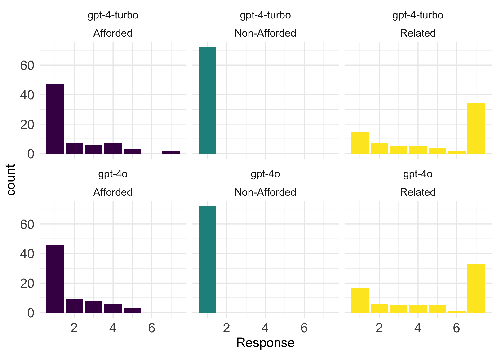<!-- -->


```r
df_closed_models %>%
  filter(model_name %in% c("gpt-4o_100", "gpt-4-turbo_100")) %>%
  ggplot(aes(x = response, fill = condition)) +
  geom_bar(stat = "count") +
  theme_minimal() +
  facet_wrap(~model_name + condition) +
  scale_fill_viridis_d() +
  labs(x = "Response") +
  theme(axis.title = element_text(size=rel(1.2)),
        axis.text = element_text(size = rel(1.2)),
        legend.text = element_text(size = rel(1.2)),
        # legend.title = element_text(size = rel(1.5)),
        strip.text.x = element_text(size = rel(1.2)),
        legend.position = "none")
```

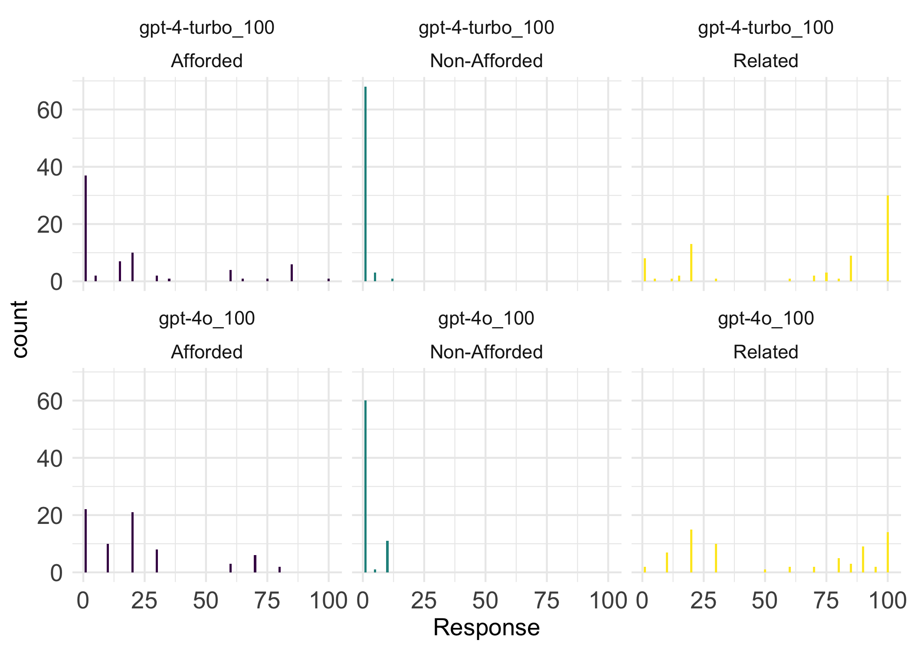<!-- -->


## Accuracy

A slightly different distribution of models is found when you compare the *average difference* between Afforded vs. Non-Afforded as opposed to the *proportion of items in which Afforded > Non-Afforded* (how "accuracy" is operationalized here).


```r
df_accuracy = df_merged %>%
  select(condition, response_z, group_id, text, 
         model_name, prompt_type) %>%
  #filter(condition != "Related") %>%
  pivot_wider(
    names_from = condition,
    values_from = c(response_z),
    names_prefix = "condition_"
  ) %>%
  mutate(diff_main = condition_Afforded - `condition_Non-Afforded`,
         diff_manipulation_check = condition_Related -`condition_Non-Afforded`) %>%
  mutate(accuracy_main = diff_main > 0,
         accuracy_manipulation_check = diff_manipulation_check > 0)
```

```
## Adding missing grouping variables: `version`
```

```r
df_accuracy %>%
  ggplot(aes(x = group_id, y = diff_main)) +
  geom_bar(stat = "identity") +
  # geom_vline(xintercept = 0, linetype = "dotted") +
  facet_wrap(~model_name) +
  theme_minimal() +
  geom_hline(yintercept = 0, linetype = "dotted") +
  labs(x = "Item Number",
       y = "Difference (Afforded vs. Non-Afforded)") +
  theme(axis.title = element_text(size=rel(1.2)),
        axis.text = element_text(size = rel(1.2)),
        legend.text = element_text(size = rel(1.2)),
        # legend.title = element_text(size = rel(1.5)),
        strip.text.x = element_text(size = rel(1.2)),
        legend.position = "none")
```

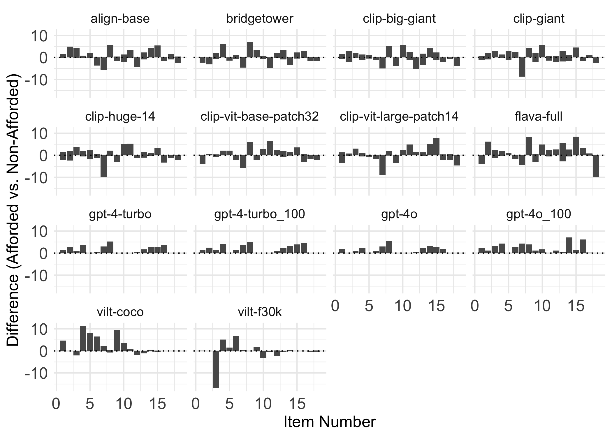<!-- -->

```r
mean(df_accuracy$accuracy_main)
```

```
## [1] 0.5049603
```

```r
mean(df_accuracy$accuracy_manipulation_check)
```

```
## [1] 0.7440476
```

```r
summary(df_accuracy$diff_main)
```

```
##      Min.   1st Qu.    Median      Mean   3rd Qu.      Max. 
## -5.597877 -0.196717  0.005409  0.214553  0.821888  4.693558
```

```r
sd(df_accuracy$diff_main)
```

```
## [1] 1.011337
```

```r
summary(df_accuracy$diff_manipulation_check)
```

```
##    Min. 1st Qu.  Median    Mean 3rd Qu.    Max. 
## -3.6852  0.0000  0.6901  0.9203  2.0172  4.0964
```

```r
sd(df_accuracy$diff_manipulation_check)
```

```
## [1] 1.292995
```

```r
accuracy_by_model = df_accuracy %>%
  group_by(model_name) %>%
  summarise(avg_accuracy_main = mean(accuracy_main),
            avg_accuracy_manipulation = mean(accuracy_manipulation_check))
accuracy_by_model
```

```
## # A tibble: 14 × 3
##    model_name             avg_accuracy_main avg_accuracy_manipulation
##    <chr>                              <dbl>                     <dbl>
##  1 align-base                         0.569                     0.681
##  2 bridgetower                        0.472                     0.722
##  3 clip-big-giant                     0.417                     0.667
##  4 clip-giant                         0.556                     0.764
##  5 clip-huge-14                       0.472                     0.625
##  6 clip-vit-base-patch32              0.556                     0.694
##  7 clip-vit-large-patch14             0.542                     0.764
##  8 flava-full                         0.597                     0.75 
##  9 gpt-4-turbo                        0.347                     0.792
## 10 gpt-4-turbo_100                    0.486                     0.889
## 11 gpt-4o                             0.361                     0.764
## 12 gpt-4o_100                         0.681                     0.958
## 13 vilt-coco                          0.528                     0.75 
## 14 vilt-f30k                          0.486                     0.597
```

```r
accuracy_by_model %>%
  ggplot(aes(x = reorder(model_name, avg_accuracy_main),
             y = avg_accuracy_main)) +
  geom_bar(stat = "identity") +
  scale_fill_viridis_d() +
  labs(x = "Model",
       y = "Accuracy (Afforded vs. Non-Afforded)") +
  coord_flip() +
  theme_minimal() +
  scale_y_continuous(limits = c(0, 1)) +
  theme(axis.title = element_text(size=rel(1.2)),
        axis.text = element_text(size = rel(1.2)),
        legend.text = element_text(size = rel(1.2)),
        # legend.title = element_text(size = rel(1.5)),
        strip.text.x = element_text(size = rel(1.2)),
        legend.position = "none")
```

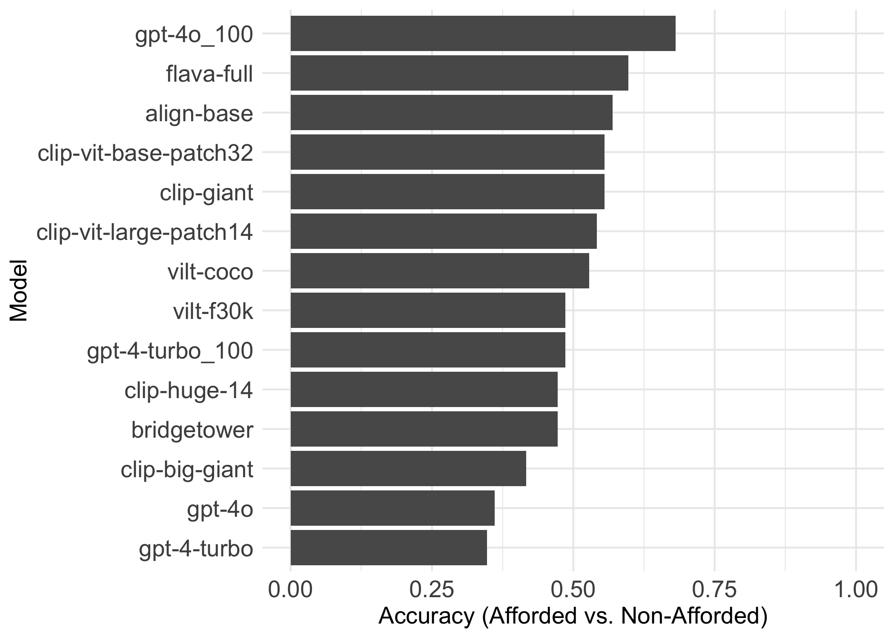<!-- -->

```r
accuracy_by_model %>%
  ggplot(aes(x = reorder(model_name, avg_accuracy_main),
             y = avg_accuracy_manipulation)) +
  geom_bar(stat = "identity") +
  scale_fill_viridis_d() +
  labs(x = "Model",
       y = "Accuracy (Canonical vs. Non-Afforded)") +
  coord_flip() +
  theme_minimal() +
  scale_y_continuous(limits = c(0, 1)) +
  theme(axis.title = element_text(size=rel(1.2)),
        axis.text = element_text(size = rel(1.2)),
        legend.text = element_text(size = rel(1.2)),
        # legend.title = element_text(size = rel(1.5)),
        strip.text.x = element_text(size = rel(1.2)),
        legend.position = "none")
```

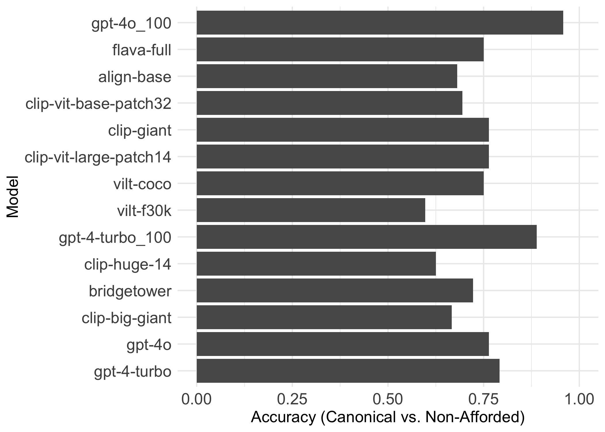<!-- -->

### Item-wise effects (main contrast)

We see clear groups of correlations.


```r
### reshape data
df_wide <- df_accuracy %>%
  group_by(model_name, group_id) %>%
  summarise(avg_diff_main = mean(diff_main)) %>%
  select(group_id, model_name, avg_diff_main) %>%
  pivot_wider(names_from = c(model_name),
              values_from = avg_diff_main)
```

```
## `summarise()` has grouped output by 'model_name'. You can override using the
## `.groups` argument.
```

```r
cols = df_wide %>%
  select(-group_id)
cor_matrix <- cor(cols, use = "complete.obs")
print(cor_matrix)
```

```
##                         align-base bridgetower clip-big-giant  clip-giant
## align-base              1.00000000  0.07782623     0.71788415  0.61279539
## bridgetower             0.07782623  1.00000000     0.06795494  0.44535466
## clip-big-giant          0.71788415  0.06795494     1.00000000  0.71613228
## clip-giant              0.61279539  0.44535466     0.71613228  1.00000000
## clip-huge-14            0.64536924  0.17891507     0.72298140  0.82543975
## clip-vit-base-patch32   0.58183823  0.27587126     0.57931088  0.60102385
## clip-vit-large-patch14  0.71940188  0.14836165     0.63087598  0.69292116
## flava-full              0.60369990  0.35856693     0.57169372  0.63395573
## gpt-4-turbo             0.31670144  0.40270769     0.24223573 -0.02534278
## gpt-4-turbo_100         0.24827691  0.41357689     0.16860215 -0.03548710
## gpt-4o                  0.27209672  0.39577865     0.29330298 -0.00406876
## gpt-4o_100              0.02992916  0.16771847     0.23022744 -0.17448759
## vilt-coco              -0.24148040  0.20536746    -0.04077169  0.03232693
## vilt-f30k              -0.27693757  0.04075887    -0.18901527 -0.16945091
##                        clip-huge-14 clip-vit-base-patch32
## align-base                0.6453692            0.58183823
## bridgetower               0.1789151            0.27587126
## clip-big-giant            0.7229814            0.57931088
## clip-giant                0.8254397            0.60102385
## clip-huge-14              1.0000000            0.77338926
## clip-vit-base-patch32     0.7733893            1.00000000
## clip-vit-large-patch14    0.8466384            0.79840336
## flava-full                0.5128217            0.69566816
## gpt-4-turbo              -0.1650306            0.13348488
## gpt-4-turbo_100          -0.1758846            0.07878610
## gpt-4o                   -0.1127444            0.15892114
## gpt-4o_100               -0.2220271           -0.17359013
## vilt-coco                -0.0849986           -0.16537284
## vilt-f30k                -0.2954291           -0.04166721
##                        clip-vit-large-patch14 flava-full gpt-4-turbo
## align-base                        0.719401876  0.6036999  0.31670144
## bridgetower                       0.148361646  0.3585669  0.40270769
## clip-big-giant                    0.630875977  0.5716937  0.24223573
## clip-giant                        0.692921160  0.6339557 -0.02534278
## clip-huge-14                      0.846638373  0.5128217 -0.16503058
## clip-vit-base-patch32             0.798403357  0.6956682  0.13348488
## clip-vit-large-patch14            1.000000000  0.7183656  0.07621445
## flava-full                        0.718365628  1.0000000  0.45134199
## gpt-4-turbo                       0.076214455  0.4513420  1.00000000
## gpt-4-turbo_100                   0.115139959  0.4346474  0.96961150
## gpt-4o                            0.116333974  0.3177852  0.86624872
## gpt-4o_100                       -0.001859394  0.1305676  0.67675288
## vilt-coco                        -0.296490447 -0.2633906 -0.13020807
## vilt-f30k                        -0.251304724 -0.1037824  0.13177281
##                        gpt-4-turbo_100      gpt-4o   gpt-4o_100   vilt-coco
## align-base                   0.2482769  0.27209672  0.029929164 -0.24148040
## bridgetower                  0.4135769  0.39577865  0.167718469  0.20536746
## clip-big-giant               0.1686021  0.29330298  0.230227439 -0.04077169
## clip-giant                  -0.0354871 -0.00406876 -0.174487594  0.03232693
## clip-huge-14                -0.1758846 -0.11274440 -0.222027084 -0.08499860
## clip-vit-base-patch32        0.0787861  0.15892114 -0.173590134 -0.16537284
## clip-vit-large-patch14       0.1151400  0.11633397 -0.001859394 -0.29649045
## flava-full                   0.4346474  0.31778523  0.130567591 -0.26339064
## gpt-4-turbo                  0.9696115  0.86624872  0.676752884 -0.13020807
## gpt-4-turbo_100              1.0000000  0.86204114  0.720708173 -0.11951253
## gpt-4o                       0.8620411  1.00000000  0.642902266 -0.13960509
## gpt-4o_100                   0.7207082  0.64290227  1.000000000  0.01275974
## vilt-coco                   -0.1195125 -0.13960509  0.012759735  1.00000000
## vilt-f30k                    0.1401638  0.09731846 -0.010698039  0.53992386
##                          vilt-f30k
## align-base             -0.27693757
## bridgetower             0.04075887
## clip-big-giant         -0.18901527
## clip-giant             -0.16945091
## clip-huge-14           -0.29542912
## clip-vit-base-patch32  -0.04166721
## clip-vit-large-patch14 -0.25130472
## flava-full             -0.10378244
## gpt-4-turbo             0.13177281
## gpt-4-turbo_100         0.14016382
## gpt-4o                  0.09731846
## gpt-4o_100             -0.01069804
## vilt-coco               0.53992386
## vilt-f30k               1.00000000
```

```r
# Plot the correlation matrix
ggcorrplot(cor_matrix, 
           hc.order = TRUE,
           method = "square" 
          )
```

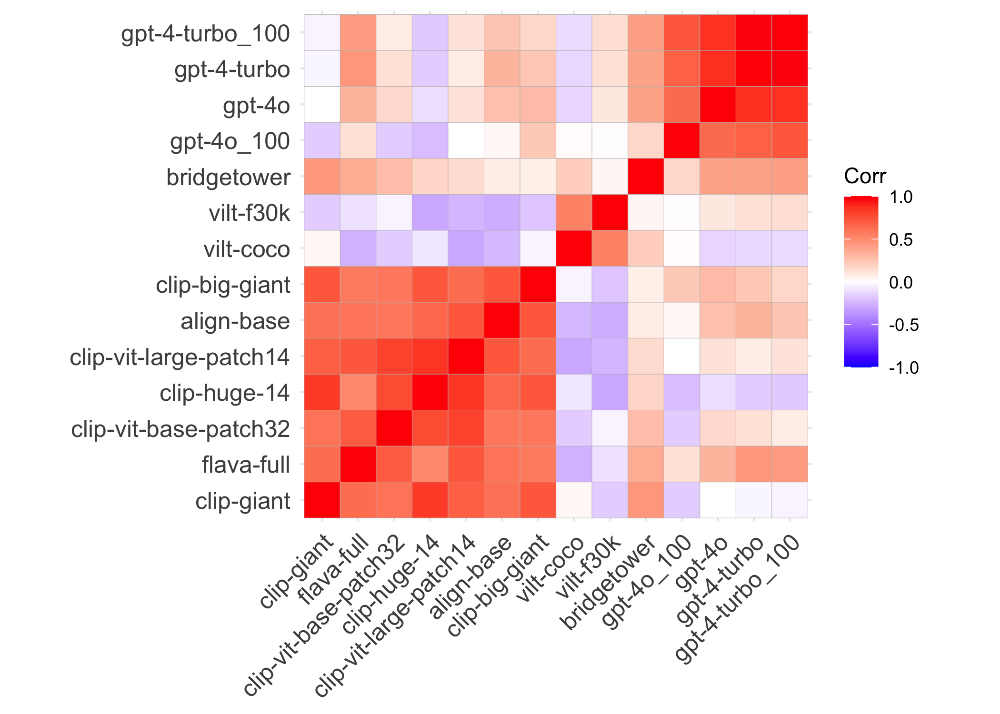<!-- -->

### Item-wise effects (manipulation check contrast)

We see clear groups of correlations.


```r
### reshape data
df_wide <- df_accuracy %>%
  group_by(model_name, group_id) %>%
  summarise(avg_diff_manipulation = mean(diff_manipulation_check)) %>%
  select(group_id, model_name, avg_diff_manipulation) %>%
  pivot_wider(names_from = c(model_name),
              values_from = avg_diff_manipulation)
```

```
## `summarise()` has grouped output by 'model_name'. You can override using the
## `.groups` argument.
```

```r
cols = df_wide %>%
  select(-group_id)
cor_matrix <- cor(cols, use = "complete.obs")
print(cor_matrix)
```

```
##                         align-base bridgetower clip-big-giant  clip-giant
## align-base              1.00000000   0.5712800     0.72813553  0.70400671
## bridgetower             0.57128003   1.0000000     0.74921703  0.58213740
## clip-big-giant          0.72813553   0.7492170     1.00000000  0.80489769
## clip-giant              0.70400671   0.5821374     0.80489769  1.00000000
## clip-huge-14            0.82079072   0.7730849     0.85832095  0.85175732
## clip-vit-base-patch32   0.64485615   0.6956109     0.91764783  0.81552326
## clip-vit-large-patch14  0.74478339   0.7343649     0.80087899  0.73614953
## flava-full              0.38266060   0.7709546     0.84277667  0.61315865
## gpt-4-turbo             0.38054804   0.2510842     0.23405213  0.12752101
## gpt-4-turbo_100         0.43777977   0.2555874     0.20203903  0.08052776
## gpt-4o                  0.35390772   0.3150413     0.29730292  0.16248836
## gpt-4o_100              0.34352214   0.3325064     0.29001520  0.21897199
## vilt-coco               0.55561967   0.4861425     0.52043197  0.27111976
## vilt-f30k              -0.05629695  -0.1195464    -0.03771603 -0.13822908
##                        clip-huge-14 clip-vit-base-patch32
## align-base                0.8207907             0.6448562
## bridgetower               0.7730849             0.6956109
## clip-big-giant            0.8583209             0.9176478
## clip-giant                0.8517573             0.8155233
## clip-huge-14              1.0000000             0.8342643
## clip-vit-base-patch32     0.8342643             1.0000000
## clip-vit-large-patch14    0.9041054             0.8196333
## flava-full                0.6633975             0.7684796
## gpt-4-turbo               0.2639848             0.2082058
## gpt-4-turbo_100           0.2681743             0.1577687
## gpt-4o                    0.3098170             0.2620351
## gpt-4o_100                0.3152010             0.2497048
## vilt-coco                 0.4804851             0.3514479
## vilt-f30k                -0.1262823            -0.2185359
##                        clip-vit-large-patch14  flava-full gpt-4-turbo
## align-base                          0.7447834 0.382660600  0.38054804
## bridgetower                         0.7343649 0.770954578  0.25108420
## clip-big-giant                      0.8008790 0.842776672  0.23405213
## clip-giant                          0.7361495 0.613158650  0.12752101
## clip-huge-14                        0.9041054 0.663397545  0.26398485
## clip-vit-base-patch32               0.8196333 0.768479644  0.20820581
## clip-vit-large-patch14              1.0000000 0.613551879  0.37740864
## flava-full                          0.6135519 1.000000000  0.15547240
## gpt-4-turbo                         0.3774086 0.155472396  1.00000000
## gpt-4-turbo_100                     0.3516202 0.067362739  0.96009746
## gpt-4o                              0.4343130 0.259419358  0.98255571
## gpt-4o_100                          0.3244627 0.299433739  0.81393012
## vilt-coco                           0.3687220 0.287031153  0.02352390
## vilt-f30k                          -0.1769203 0.003561672  0.06280067
##                        gpt-4-turbo_100      gpt-4o gpt-4o_100   vilt-coco
## align-base                  0.43777977 0.353907725 0.34352214 0.555619669
## bridgetower                 0.25558741 0.315041326 0.33250638 0.486142514
## clip-big-giant              0.20203903 0.297302920 0.29001520 0.520431971
## clip-giant                  0.08052776 0.162488357 0.21897199 0.271119758
## clip-huge-14                0.26817428 0.309816979 0.31520098 0.480485132
## clip-vit-base-patch32       0.15776867 0.262035142 0.24970476 0.351447860
## clip-vit-large-patch14      0.35162024 0.434312987 0.32446272 0.368722030
## flava-full                  0.06736274 0.259419358 0.29943374 0.287031153
## gpt-4-turbo                 0.96009746 0.982555715 0.81393012 0.023523896
## gpt-4-turbo_100             1.00000000 0.937977810 0.82202133 0.085783554
## gpt-4o                      0.93797781 1.000000000 0.83705791 0.007966125
## gpt-4o_100                  0.82202133 0.837057909 1.00000000 0.084384863
## vilt-coco                   0.08578355 0.007966125 0.08438486 1.000000000
## vilt-f30k                   0.08453195 0.080355776 0.33577793 0.411655863
##                           vilt-f30k
## align-base             -0.056296948
## bridgetower            -0.119546416
## clip-big-giant         -0.037716029
## clip-giant             -0.138229079
## clip-huge-14           -0.126282329
## clip-vit-base-patch32  -0.218535851
## clip-vit-large-patch14 -0.176920267
## flava-full              0.003561672
## gpt-4-turbo             0.062800674
## gpt-4-turbo_100         0.084531950
## gpt-4o                  0.080355776
## gpt-4o_100              0.335777929
## vilt-coco               0.411655863
## vilt-f30k               1.000000000
```

```r
# Plot the correlation matrix
ggcorrplot(cor_matrix, 
           hc.order = TRUE,
           method = "square" 
          )
```

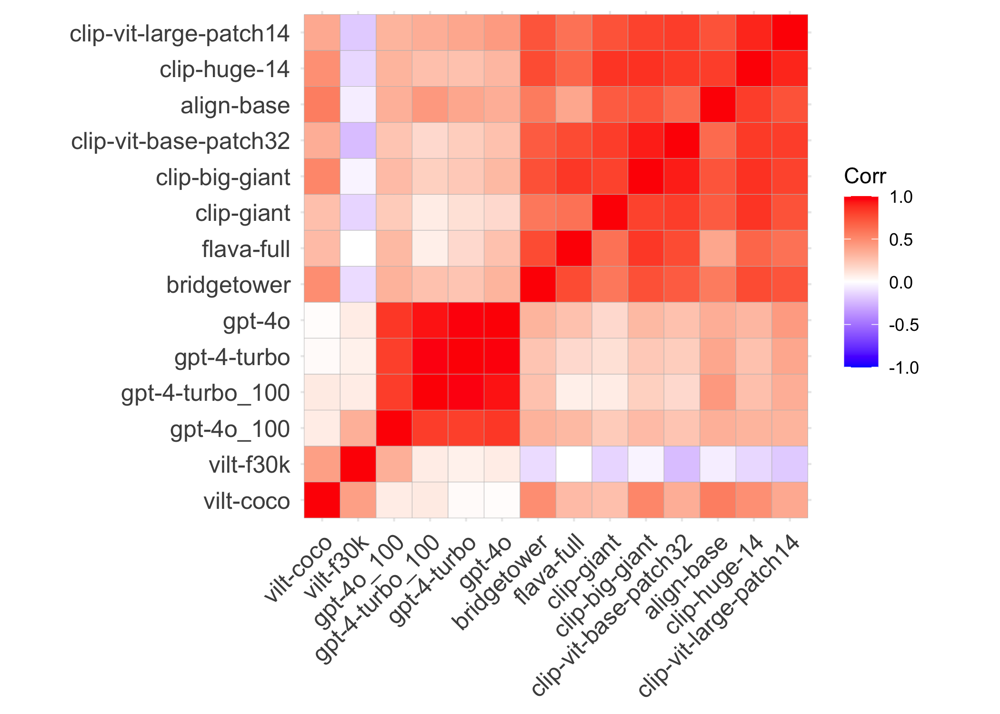<!-- -->
## Cross-architecture analysis


```r
df_hf_models = df_hf_models %>%
  mutate(architecture = case_when(
    model_name %in% c("vilt-coco", "bridgetower", "vilt-f30k") ~ "Fusion",
    model_name %in% c("flava-full") ~ "Both",
    TRUE ~ "Dual-Encoder"
  ))

df_summary <- df_hf_models %>%
  group_by(condition, architecture) %>%
  summarize(avg_response = mean(response_z, na.rm = TRUE),
            se_response = sd(response_z, na.rm = TRUE) / sqrt(n()))
```

```
## `summarise()` has grouped output by 'condition'. You can override using the
## `.groups` argument.
```

```r
ggplot(df_summary, aes(x = architecture, y = avg_response, 
                       color = condition, group = condition)) +
  geom_point(size = 3, 
             position = position_dodge(width = 0.5)) +  
  geom_errorbar(aes(ymin = avg_response - se_response, 
                    ymax = avg_response + se_response), 
                width = 0.2,
                position = position_dodge(width = 0.5)) + 
  labs(# title = "",
       x = "Architecture",
       y = "Z-scored Response",
       color = "") +
  coord_flip() +
  geom_hline(yintercept = 0, linetype = "dotted") +
  theme_minimal() +
  scale_color_viridis_d() +
  theme(axis.title = element_text(size=rel(1.2)),
        axis.text = element_text(size = rel(1.2)),
        legend.text = element_text(size = rel(1.2)),
        # legend.title = element_text(size = rel(1.5)),
        strip.text.x = element_text(size = rel(1.2)),
        legend.position = "bottom") 
```

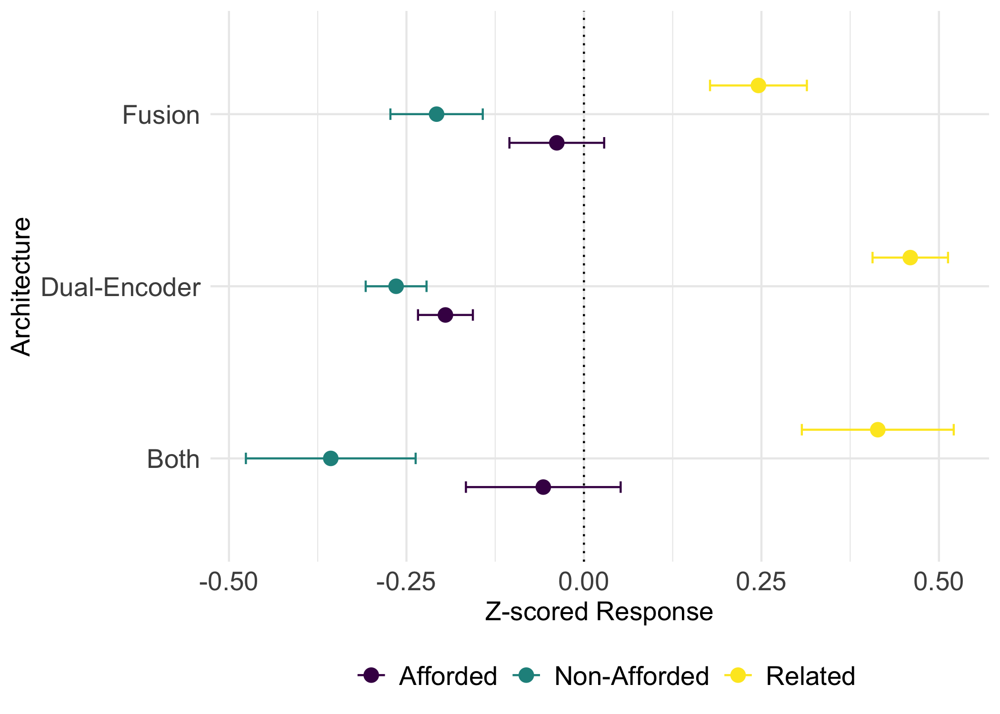<!-- -->

## Scale Analysis


```r
df_hf_models = df_hf_models %>%
  mutate(architecture = case_when(
    model_name %in% c("vilt-coco", "bridgetower", "vilt-f30k") ~ "Fusion",
    model_name %in% c("flava-full") ~ "Both",
    TRUE ~ "Dual-Encoder"
  ))


df_summary <- df_hf_models %>%
  group_by(architecture, num_params, condition) %>%
  summarize(
    avg_response = mean(response_z, na.rm = TRUE),
    se_response = sd(response_z, na.rm = TRUE) / sqrt(n()),
    .groups = 'drop'
  ) %>%
  pivot_wider(
    names_from = condition,
    values_from = c(avg_response, se_response),
    names_prefix = "condition_"
  ) %>%
  mutate(
    avg_effect = avg_response_condition_Afforded - `avg_response_condition_Non-Afforded`,
    avg_manipulation_check = avg_response_condition_Related - `avg_response_condition_Non-Afforded`,
    se_effect = sqrt(se_response_condition_Afforded^2 + `se_response_condition_Non-Afforded`^2),
    se_manipulation_check = sqrt(se_response_condition_Related^2 + `se_response_condition_Non-Afforded`^2),
  )


ggplot(df_summary, aes(x = num_params, y = avg_effect, 
                       color = architecture)) +
  geom_point(size = 6, alpha = .5) +  
  geom_errorbar(aes(ymin = avg_effect - se_effect, 
                    ymax = avg_effect + se_effect), 
                width = 0.2) + 
  labs(# title = "",
       x = "Number of Parameters",
       y = "Effect Size",
       color = "") +
  geom_hline(yintercept = 0, linetype = "dotted") +
  theme_minimal() +
  scale_color_viridis_d() +
  scale_y_continuous(limits = c(-1, 1)) +
  theme(axis.title = element_text(size=rel(1.2)),
        axis.text = element_text(size = rel(1.2)),
        legend.text = element_text(size = rel(1.2)),
        # legend.title = element_text(size = rel(1.5)),
        strip.text.x = element_text(size = rel(1.2)),
        legend.position = "bottom") 
```

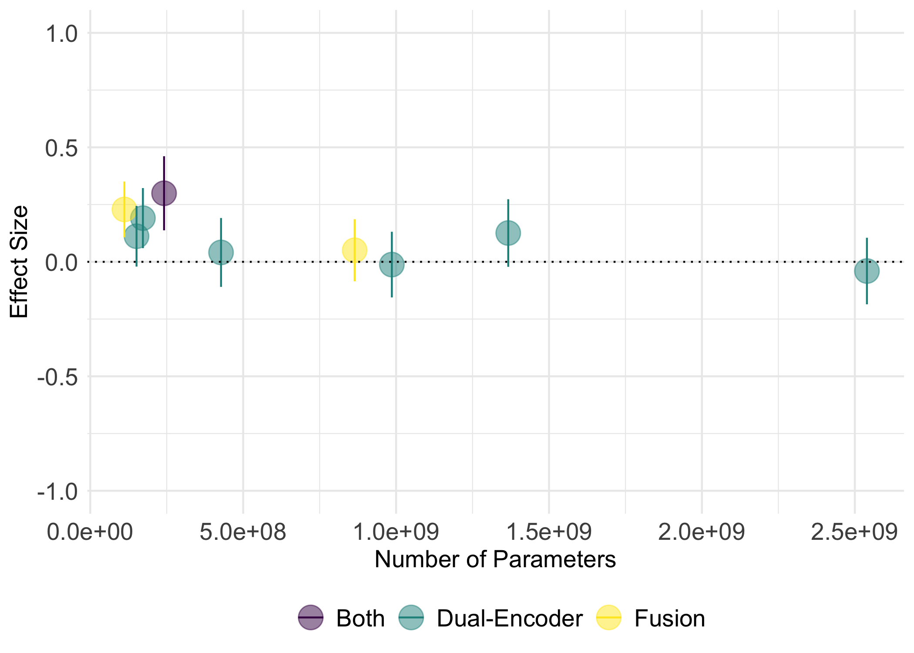<!-- -->

```r
ggplot(df_summary, aes(x = num_params, y = avg_manipulation_check, 
                       color = architecture)) +
  geom_point(size = 6, alpha = .5) +  
  geom_errorbar(aes(ymin = avg_manipulation_check - se_manipulation_check, 
                    ymax = avg_manipulation_check + se_manipulation_check), 
                width = 0.2) + 
  labs(# title = "",
       x = "Number of Parameters",
       y = "Effect Size",
       color = "") +
  geom_hline(yintercept = 0, linetype = "dotted") +
  theme_minimal() +
  scale_color_viridis_d() +
  scale_y_continuous(limits = c(-1, 1)) +
  theme(axis.title = element_text(size=rel(1.2)),
        axis.text = element_text(size = rel(1.2)),
        legend.text = element_text(size = rel(1.2)),
        # legend.title = element_text(size = rel(1.5)),
        strip.text.x = element_text(size = rel(1.2)),
        legend.position = "bottom") 
```

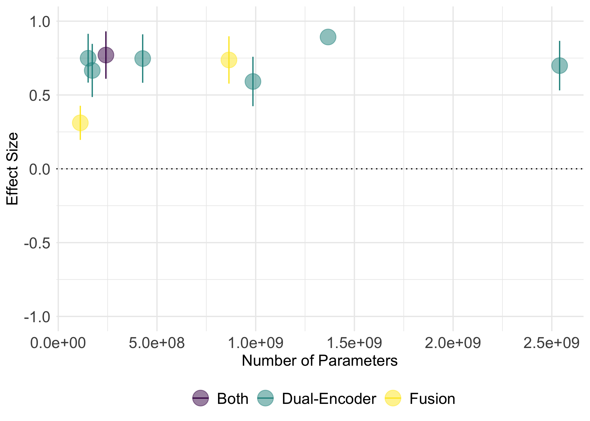<!-- -->


## Role of `version` and `prompt_type`


```r
mod_full = lmer(data = filter(df_hf_models, condition != "Afforded"), 
                response_z ~ condition * version + condition * prompt_type+ 
                  (1 | group_id) + (1 | model_name), 
                    REML = FALSE)
```

```
## boundary (singular) fit: see help('isSingular')
```

```r
df_summary <- df_hf_models %>%
  group_by(condition, model_name, prompt_type) %>%
  summarize(avg_response = mean(response_z, na.rm = TRUE),
            se_response = sd(response_z, na.rm = TRUE) / sqrt(n()))
```

```
## `summarise()` has grouped output by 'condition', 'model_name'. You can override
## using the `.groups` argument.
```

```r
ggplot(df_summary, aes(x = model_name, y = avg_response, 
                       color = condition, group = condition)) +
  geom_point(size = 3, 
             position = position_dodge(width = 0.5)) +  
  geom_errorbar(aes(ymin = avg_response - se_response, 
                    ymax = avg_response + se_response), 
                width = 0.2,
                position = position_dodge(width = 0.5)) + 
  labs(# title = "",
       x = "",
       y = "Z-scored Response",
       color = "") +
  coord_flip() +
  geom_hline(yintercept = 0, linetype = "dotted") +
  theme_minimal() +
  scale_color_viridis_d() +
  theme(axis.title = element_text(size=rel(1.2)),
        axis.text = element_text(size = rel(1.2)),
        legend.text = element_text(size = rel(1.2)),
        # legend.title = element_text(size = rel(1.5)),
        strip.text.x = element_text(size = rel(1.2)),
        legend.position = "bottom") +
  facet_wrap(~prompt_type)
```

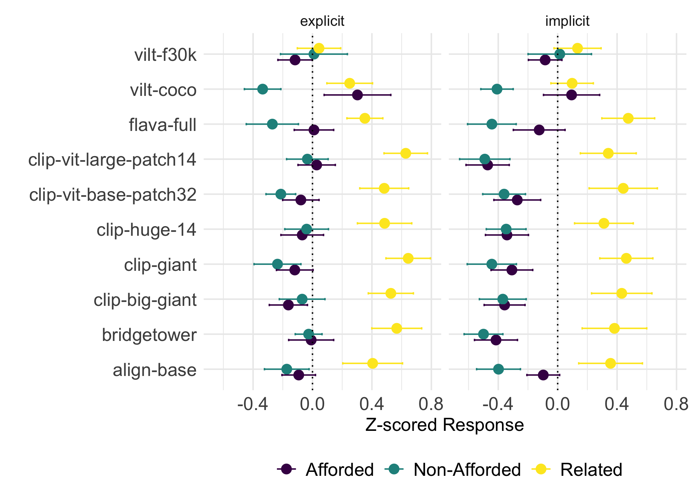<!-- -->

```r
df_summary <- df_hf_models %>%
  group_by(condition, model_name, version) %>%
  summarize(avg_response = mean(response_z, na.rm = TRUE),
            se_response = sd(response_z, na.rm = TRUE) / sqrt(n()))
```

```
## `summarise()` has grouped output by 'condition', 'model_name'. You can override
## using the `.groups` argument.
```

```r
ggplot(df_summary, aes(x = model_name, y = avg_response, 
                       color = condition, group = condition)) +
  geom_point(size = 3, 
             position = position_dodge(width = 0.5)) +  
  geom_errorbar(aes(ymin = avg_response - se_response, 
                    ymax = avg_response + se_response), 
                width = 0.2,
                position = position_dodge(width = 0.5)) + 
  labs(# title = "",
       x = "",
       y = "Z-scored Response",
       color = "") +
  coord_flip() +
  geom_hline(yintercept = 0, linetype = "dotted") +
  theme_minimal() +
  scale_color_viridis_d() +
  theme(axis.title = element_text(size=rel(1.2)),
        axis.text = element_text(size = rel(1.2)),
        legend.text = element_text(size = rel(1.2)),
        # legend.title = element_text(size = rel(1.5)),
        strip.text.x = element_text(size = rel(1.2)),
        legend.position = "bottom") +
  facet_wrap(~version)
```

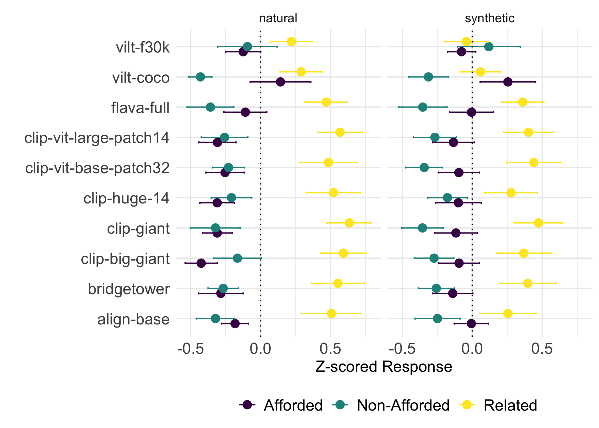<!-- -->

